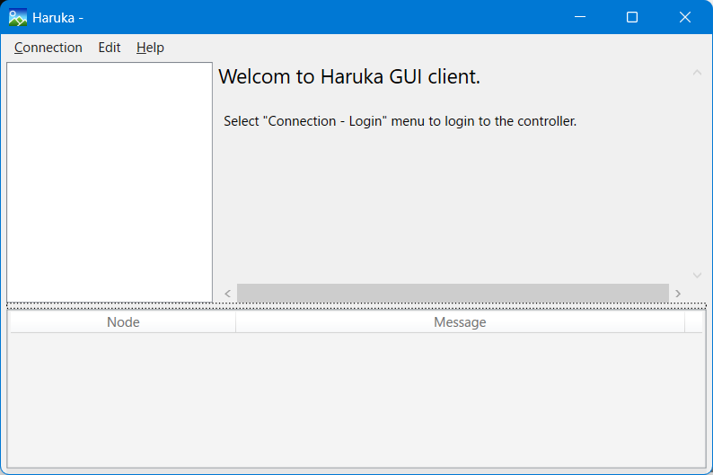
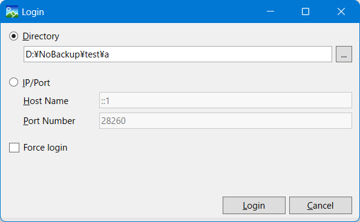
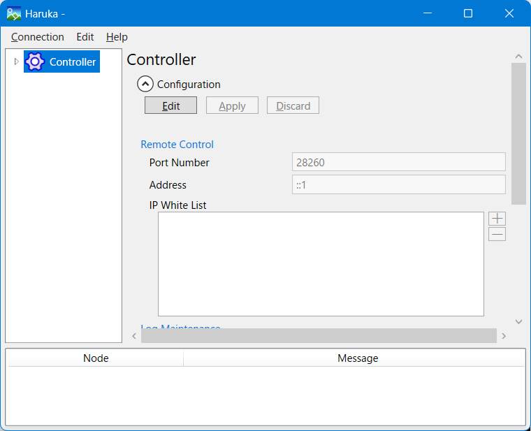

# Haruka Software Storage

Haruka is an iSCSI Target made by software.

It lets you combine many kinds of storage media.  
You can make flexible and complex storage setups.

# How to use

## Build

Download the source code. Run this command to build:

```
MSBuild Haruka.sln -t:Rebuild -p:Configuration=Release
```

Build outputs:
- GUI files: .\work\Release\net8.0-windows  
- Other files: .\work\Release\net8.0

Please copy these files by hand into one folder.

## Initialize controller directory

Run:

```
.\Controller.exe ID DirName
```

## Start controller process

Run:

```
.\Controller.exe SV DirName
```

## Change settings from client

Run the client:

```
.\ClientGUI.exe
```

When the client starts, you see this screen:



Choose menu "connection" → "Login".



Enter the controller directory path, or enter controller host and TCP port  
(default ::1 and 28260). Then press the "Login" button.

If connection works, you see this screen:



Use the GUI to make storage configurations and start target devices.

# Development status

Minimum functions are implemented.  
We are now writing test cases.  
Documentation is not written yet.
